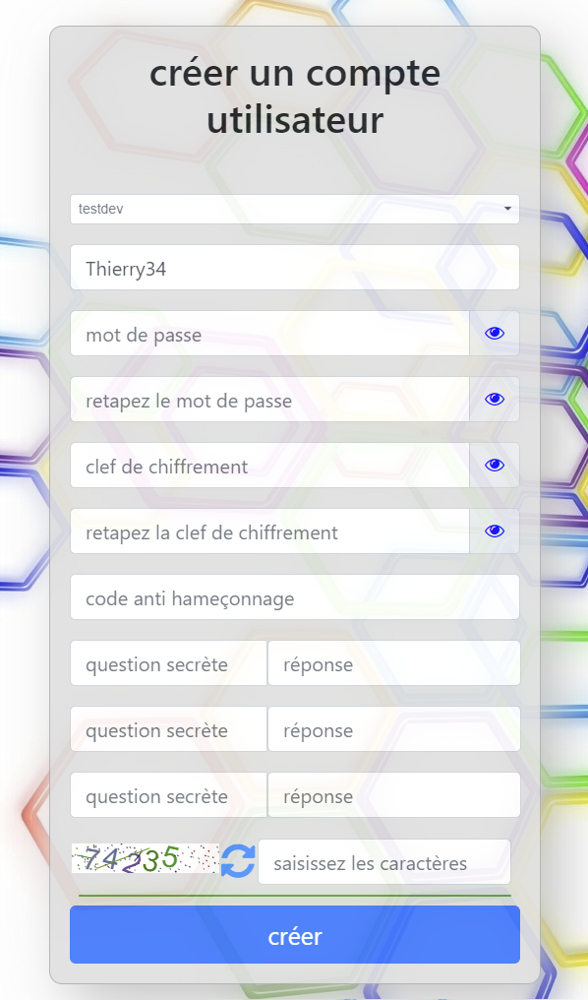

# Créer un compte

Avant toute chose vous devez créer un compte sur la plateforme beswarm.

Pour cela il suffit de se rendre à l'adresse https://www.beswarm.net puis de choisir
#### création d'un compte utilisateur.

Un formulaire de saisie s'affiche et vous demande de renseigner diverses informations.

## Essaim
L'essaim est en fait une base de données dans laquelle sont stockées toutes vos données.
BeSwarm met à votre dispositions plusieurs bases de données. Il vous suffit de choisir
celle qui vous convient. 
#### Important: Une fois l'essaim choisi, il n'est plus possible de le changer.

## Login
Choisissez un login. Il n'est pas nécessaire ni conseillé de mettre une adresse mail comme sur la plupart
des sites qui requièrent un compte utilisateur.
Pour rappel BeSwarm se veut être un service de gestion de données personnelles anonymes.
Nous ne vous demanderons donc jamais de données nous permettant de vous identifier.
Choisssez donc un login neutre et qui vous convient.

Ex: Thierry34

## Mot de passe
Choissez un mot de passe suffisament sécurisé et que vous pourrez mémoriser.

## Clef de chiffrement
Afin de vous garantir un maximum de sécurité et de confidentialité, grace à cette clef vous avez la garantie
absolue que personne d'autre ne peut avoir accès à vos données.
Il n'est pas nécessaire qu'elle soit très longue, mais elle doit être suffisament complexe pour être difficile à deviner.
Vous pouvez tout à fait choisir ce que l'on appelle une paraphrase comme par exemmple:
Mon chat est beau
### Important: Cette clef est définitive et ne pourra plus être changée. Si vous la perdez l'ensemble de vos données
### personnelles sont définitivement inaccessibles.

## Code anti hameçonnage
Ceci vous permet d'avoir un contrôle sur la page d'identification sur laquelle vous tentez de vous identifier.
Dès que vous avez saisi votre login, ce code s'affichera avant que vous ne mettiez votre mot de passe
et votre clef de chiffrement.
Si le code affiché est effectivent le vôtre, vous avez l'assurance que vous êtes bien sur la page d'authentification
de BeSwarm. Si ce n'est pas le cas, il est possible que vous soyez victime d'un hameçonnage.

## Questions secrêtes
Etant donné que nous ne connaissons pas votre adresse mail et/ou votre numéro de téléphone, il ne nous est
pas possible de vous envoyer un lien si vous avez oublié votre mot de passe afin de le réinitialiser.
Si tel est le cas, vous devrez donner la réponse à ces trois questions.
Choissez les donc simples avec une réponse que vous êtes certain(e) de pouvoir mémoriser.
Ex:
#### Question 1: Quel est le nom de mon premier animal de compagnie?
#### Réponse 1: Milou
#### Question 2: Quel est le nom de mon premier professeur?
#### Réponse 2: Dupont
#### Question 3: Quel est le nom de mon premier enfant?
#### Réponse 3: Jeanne

Enfin avant de cliquer sur le bouton créer, saisisez les caractères qui s'affichent dans le cadre.
C'est pour nous un moyen de vérifier que le compte est bien crée par un humain.
Si toutefois les caractères affichés ne sont pas assez lisibles, vous pouvez cliquer sur le bouton avec les
deux flêches afin de généer un nouveau texte.

Lorsque toutes ces données ont été saisies et que vous les avez contrôlées, vous pouvez cliquer sur le bouton créer.

## Votre compte est alors créé et vous pourrez vous identifier.