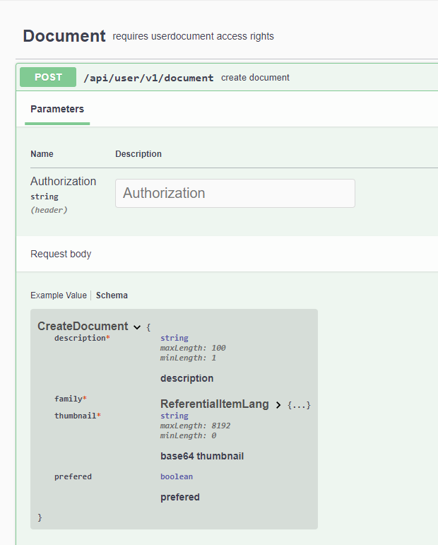

Voici quelques bonnes pratiques à mettre en oeuvre afin de développer des applications de qualité:

### Gerer les status d'appels aux web api
Il peut y avoir x raisons pour qu'un appel de webapi n'aboutisse pas.
(problème de réseau, indisponibilité du service, erreur dans l'application).
Il faut donc systématiquement prévoir que l'appel peut échouer et en fonction du code retour prévoir l'action corrective.
Il existe d'excellentes librairies permettant de réaliser ces actions.
Le contrôle du status est également primordial afin de s'assurer que la requête a bien été prise en compte.
Il peut y avoir x raisons pour que la requête soit rejetée:
* droits insuffisants
* données non conformes
* jeton périmé
* erreur dans le format des données
* etc.

### Proposer des fonctionnalités compatibles avec les droits accordés.
Comme décrit dans la partie Notions de base, l'application définit les droits d'accès qu'elle souhaite et l'utilisateur les accèpte ou pas.
Si un utilisateur n'a pas accepté un droit d'accès non requis l'application ne doit en aucun cas proposer la fonctionnalité qui utilise cet accès.
Dans tous les cas la web api correspondante sera rejetée et l'expérience utilisateur s'en trouvera dégradée.
Pour rappel les droits que l'utilisateur a octroyé à l'application sont dans le jeton JWT dans la variable scope.
L'application doit dès qu'elle reçoit le jeton adapter son comprtement en conséquence.

### Contrôler la validité des données avant de les envoyer.
Toutes les web api permettant d'ajouter, de modifier et de supprimer des données contrôlent ces données lors du traitement
de la web api. Ces contrôles sont effectués sur les attributs présents dans la définition des modèles de données de la web api.
Pour rappel ces attributs sont visibles depuis l'interface swagger.
Il est donc important que l'application contrôle elle même la validité de ces données avant de les envoyer à la web api qui dans tous les
cas rejettera l'appel avec un code d'erreur.
Exemple:

Pour cette webapi, il sera contrôlé que:
* la description est obligatoire et doit comporter de 1 à 100 caractères
* la famille est obligatoire
* la vignette est obligatoire et doit être inférieure à 8192 caractères

Toute tentative d'appel de cette web api echouera et retournera un code d'erreur

### Optimliser les appels des web api.
Afin que l'application soit la plus fluide possible et soit le moins sujette possible à des éventuels problèmes réseaux,
il est judicieux d'optimliser les appels aux web api.
Prenons en exemple d'applications qui va gérer une liste de tâches à faire.
Lors du lancement elle va appeler la web api permettant de retrouver la liste de toutes les tâches à faire pour l'utilisateur connecté et elle
va mettre cette liste en mémoire.
Lorsqu'un utilisateur veut rajouter une tâche l'application va:
* afficher la page de saisie d'une nouvelle tâche
* la contrôler
* et invoquer la web api d'ajout d'une tâche.

Si le status de cet appel est un succès l'application pourrait par facilité demander à nouveau la liste de toutes les taches et la mettre en mémoire.
Cela va charger inutilement l'application d'une part et va la ralentir de par cet appel inutile.
Au lieu de cela, elle peut et doit exploiter les données reçues en retour de cet appel et directement insérer la nouvelle tâche dans sa liste des tâches en mémoire.
Pour l'utilisateur cela aura la même conséquence mais l'application sera beacoup plus réactive.
Il en est de même pour les opérations de suppression et de modification.
