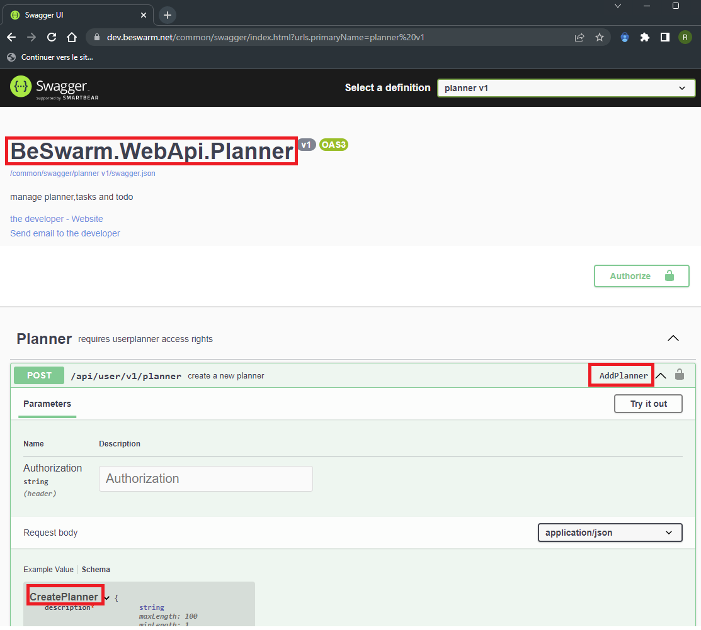

Toutes les classes sont générés dans des namespaces différents.
Chaque namespace corrspond à au type d'objet manipulé par les webapi correspondantes.
Le nom du namespace ainsi que le nom de la fonction est disponible dans l'interface swagger.

Ex:



Le code correspondant afin d'ajouter une tâche dans le planning sera:

```csharp 

var httpclient = Session.GetUserHttpClient();
BeSwarm.WebApi.Planner.Planner plan = new("", httpclient);

BeSwarm.WebApi.Planner.CreatePlanner create = new();
create.Description = "....";
try
{
	var result = await plan.AddPlannerAsync(Session.UserToken, create);
}
catch (Exception e)
{
}

```


