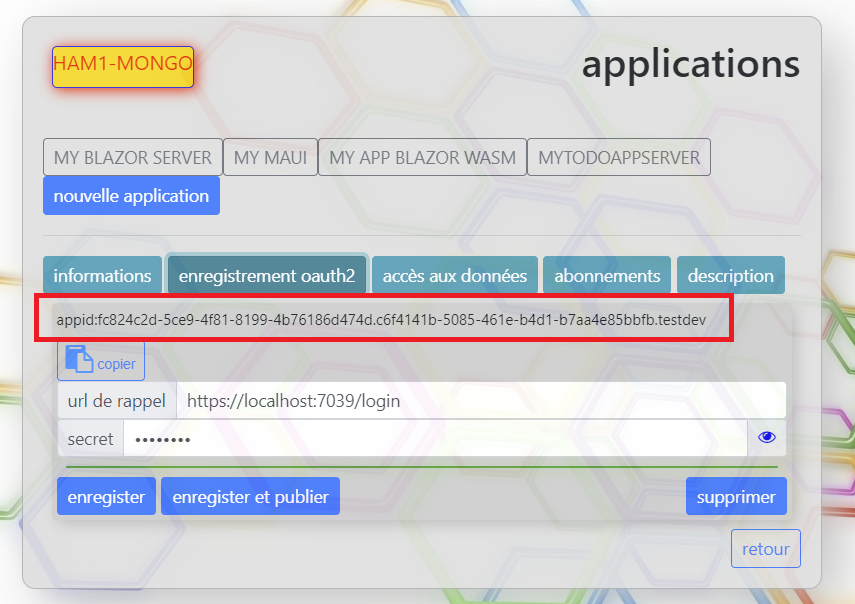

Pour des questions de sécurité et de confidentialité des informations d'identification de l'utilisateur, une application ne peut
invoquer l'authentification d'un utilisateur que par un mécansime avec une logique oauth2.

L'authentification Oauth2 de BeSwarm reprend les principes de base d'une authentification OAuth2 avec toutefois
des spécificités propres à la plateforme.

Pour rappel lorsque l'application a été enregistrée, il a été fourni des informations sur l'enregistrement oauth2 avec notamment l'url de rappel et le
secret afin de récupérer le jeton authentifiant l'utilisateur.

Pour faire très simple une authentification oauth2 se déroule en plusieurs étapes:

* L'application invoque l'url d'authentification de BeSwarm.
* L'utilisateur est redirigé vers BeSwarm pour s'authentifier.
* L'utilisateur s'identifie et accepte l'accès à ses données.
* L'authentification BeSwarm rappelle l'application (avec l'url de rappel)
* L'application récupère le jeton d'accès à l'aide du secret et de l'url de rappel.	

Nous allons détailler chacune de ces étapes.

#### L'application invoque l'url d'authentification de BeSwarm
Lorsque l'application a été crée il lui a été attribué un indentifiant unique.
Cet identifiant se trouve dans l'onglet authentification de l'application.
	
Un bouton bouton permet de le copier dans le presse papier.

L'application doit invoquer l'url d'authentification de BeSwarm en lui passant divers paramètres:
* un state
* l'identifiant de l'application
* un code_challenge

Le state est une chaine aléatoire qui sera retournée à l'application afin qu'elle puisse s'assurer que l'url de rappel est bien celle que l'application
a initié.
Le code_challenge est une chaine aléatoirequi devra être fourni pour récupérer le jeton d'accès. Il permet de s'assurer que la demande de jeton émane bien d'une application
qui a inité la demande d'authentification.
Important: Lors de l'appel de l'url d'authentification c'est le hash SHA256 de ce code qui doit être passé.

Exemple:
https://dev.beswarm.net/Authorize?
state=monetat
&appid=67859daa-76d4-4c74-a27c-d76cf7f8842e.c52de624-986a-43d5-9b9f-056823c04018.providerswarm
&code_challenge=993439d0ad840e635cd82374dd2dc5b010d1c8a14bfc8561c5faa487e53be51d

Dans cet exemple le code_challenge qui a été généré est 9819811 et la chaine 993439d0ad840e635cd82374dd2dc5b010d1c8a14bfc8561c5faa487e53be51d est le
SHA256	du code_challenge.

#### L'application est rappelée via son url de rappel
Si l'utilisateur c'est correctement authentifié et qu'il a accepté les autorisations d'accès demandées par l'application, BeSwarm rappelle l'application
via son url de rappel avec les informations suivantes:
https://www.monapp.fr/login?state=monetat&code=YWU5M2FhM2YtMTZkMi00MWUzLTkxM2UtZTQxZjc5YzM4ODUy&swarm=userswarm&serviceurl=https://dev2.beswarm.net

state retourne le state passé lors de l'appel de l'url beswarm. L'application peut s'assurer que c'est bien celui qu'elle a généré.
code est le code d'échange qui permettra à l'application de récupérer le jeton d'accès.
swarm est l'essaim sur lequel l'utilistaeur c'est authentifié.
serviceurl est l'url de service sur lequel l'utilisateur s'est authentifié.

Il est important à ce stade de comprendre ce qui a été retourné et notamment le serviceurl.
Pour rappel l'environnement BeSwarm est totalement décentralisé et il peut exister autant de services que d'essaims.
L'application ne connaissant pas l'utilisateur n'a donc aucun moyen de savoir quel service invoquer ni quel essaim utiliser.
C'est pour cela qu'elle fait une demande d'authentfication sur n'importe quel service et c'est l'authentification Be Swarm qui en fonction de l'essaim selectionné 
par l'utilistateur retourner l'url du service qui gère cet essaim.
Car c'est sur cette url que le jeton deva être récupéré.

#### Récupération du jeton
La récupération du jeton se fait via une url en post.
L'url est à envoyé sur le service retourné par service url.
Dans notre exemple ce sera https://dev2.beswarm.net/api/access/v1/usertoken
avec comme corps de requête les données suivantes

{ "code_challenge":"9819811",
   "client_secret":"MonSecret",
   "code":"YWU5M2FhM2YtMTZkMi00MWUzLTkxM2UtZTQxZjc5YzM4ODUy",
   "swarm":"userswarm"
}
code_challenge est le code_challenge généré lors de l'appel de l'url d'authentification.
clien_secret est le secret de l'application tel que défini dans la partie enregistrement oauth2 de l'application.
code est le code retourné par l'url de rappel.
swarm est l'essaim sur lequel l'utilisateur s'est authentifié et qui est retourné par l'url de rappel.

Dès lors l'application va recevoir le jeton d'authentification qui lui permettra d'accéder aux données de l'utilisateur.

Important: L'application doit être en mesure de garder secret tous les identifiants qu'elle a eu à fournir comme:
l'appid, le client_secret et le code_challenge.
Si l'appid ou le client_secret sont divulgués, une application malveillante pourrait usurper l'identité de l'application et récupérer des jetons d'accès.
Si le code_challenge est divulgué, une application malveillante pourrait renouveler le jeton d'accès.
