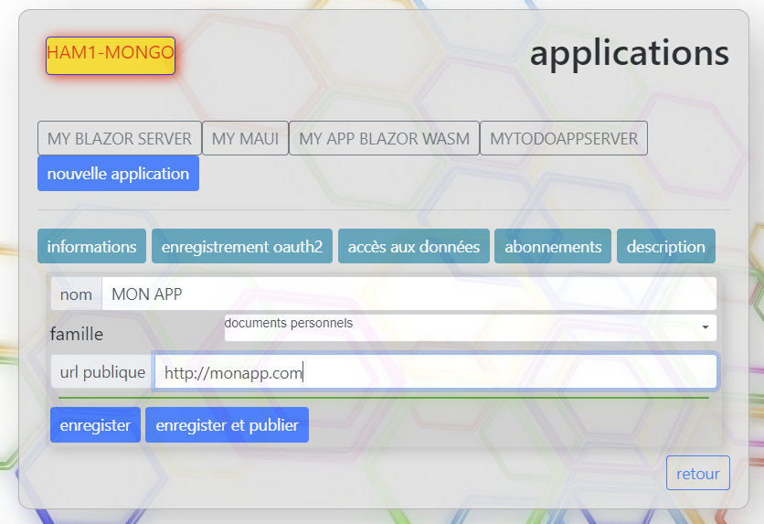
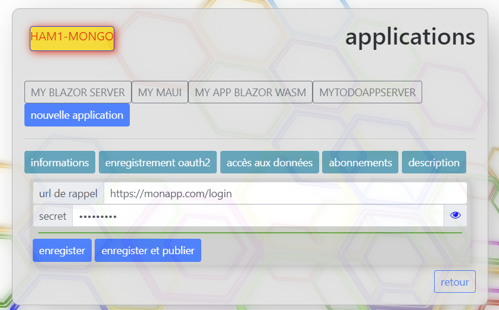
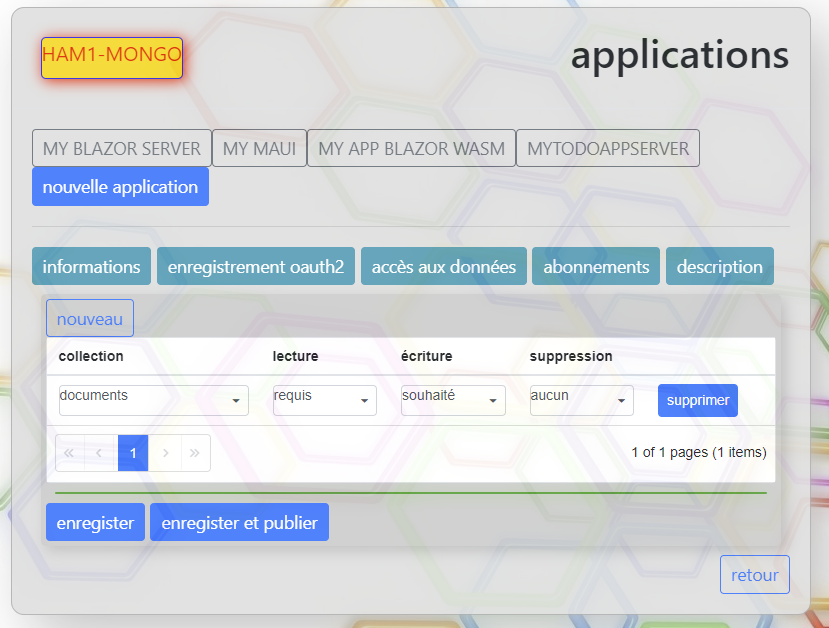

Avant de commencer à développer une application, cette dernière doit être inscrite sur la plateforme BeSwarm.

L'inscription permet notamment de spécifier ce que l'application compte manipuler comme type de données afin que
l'utilisateur puisse ou pas octroyer l'accès à ces données.
Elle permet également de définir la configuration de l'authentification.

L'inscription d'une application se fait via la page de gestion du compte utilisateur dans la rubrique mes applications.
Il faut bien évidemment au préalable avoir crée un compte utilisateur sur la plateforme BeSwarm.

La création d'une application se fait depuis plusieurs onglets

## L'onglet informations

## L'onglet enregistrement oauth2
C'est dans cet onglet que l'on définit la configuration de l'authentification avec notamment la ou les urls de rappel ansi que
le secret permettant de s'assurer que la demande émane bien de l'application.
Cela est détaillé dans la section [Authentification](/docs/DevApps/NotionsDeBase/Authentification).

:::info Information
Il est possible de définir plusieurs urls de rappel. Dans ce cas, il faut les séparer par une virgule.
Cela permet d'avoir une application disponible depuis différents environnements.
Ex: une applicaation PWA avec son url et la même application sous android avec une url de rappel spécifique.
:::

## L'onglet accès aux données

Il permet de spécifier les types de données que l'application souhaite manipuler.
L'application doit explicitement ajouter les types de données qu'elle souhaite manipuler ainsi que les types d'accès qu'elle souhaite avoir.
Il y a 3 types d'accès possibles :
* Lecture 
* Ecriture
* Suppression

Pour ces trois types elle doit spécifier si elle le requiert, le souhaite ou ne l'utilise pas.
La différence entre les trois notion est gérée comme cela:
Si l'application requiert l'accès à un type de données, elle ne pourra pas fonctionner sans.
Si l'application souhaite l'accès à un type de données, elle pourra fonctionner sans mais elle ne pourra pas accéder à ces données.

Ces informations sont utilisées par l'utilisateur pour décider si il souhaite ou pas donner accès à ces données à l'application au moment de l'authentification.

:::info Information  
L'utilisateur soit accepter (ou pas) les autorisations demandées par l'application lors de la première connexion à l'application uniquement.
Si l'utilisateur n'autorise pas un accès requis par l'application, l'utilisateur ne sera pas authentifié auprès de cette application.
:::

Les deux derniers onglets permettent de définir mes modalités d'abonnement à l'application ainsi qu'un bref descriptif de l'application.

Une fois que ces informations sont renseignées il faut soit enregister l'application soit enregister et publier l'application.

#### Enregistrer l'application	
Cela permet d'enregistrer l'application afin de pouvoir développer l'application correspondante sant toutefois que l'application apparaîsse dans
le catalogue des applications.

#### Enregistrer et publier
Enregistre l'application et la publie dans le catalogue des applications.

<iframe width="560" height="315" src="https://www.youtube.com/embed/NXF0ep5QtoM" title="YouTube video player" frameborder="0" allow="accelerometer; autoplay; clipboard-write; encrypted-media; gyroscope; picture-in-picture" allowfullscreen></iframe>

