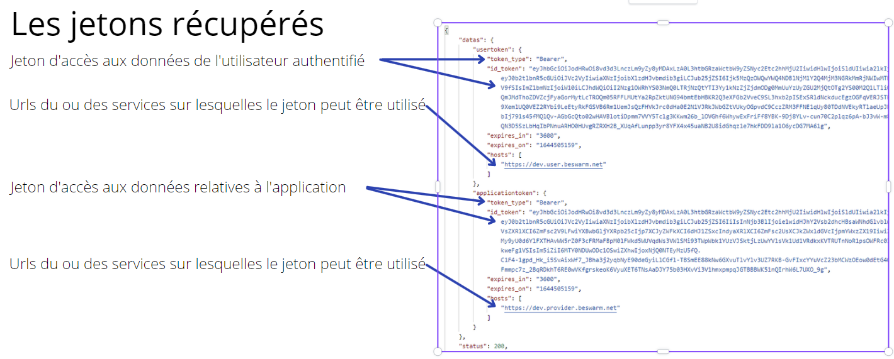

Lorsque l'application a reçu un jeton d'accès elle devra le fournir dans les requêtes HTTP pour accéder aux données de l'utilisateur.

Les données retournées sont d'une part le jeton d'accès JWT mais aussi d'autres informations nécessaires afin d'appeler correctement
les urls des services concernés.




la strucure de données contient:
* le jeton utilisateur (userotken)
* sa durée de validité
* la ou les urls de services utilisables avec ce jeton

* le jeton applicatif (applicationtotken)
* sa durée de validité
* la ou les urls de services utilisables avec ce jeton

Le jeton applicatif permet d'accéder aux informations relatives à l'application.


## Comment utiliser le jeton utilisateur
Il est à passer via le header Authorize de la requête HTTP sous la forme suivante:
```
Authorization: Bearer <uid_token>
```
## Utiliser la liste des hosts
Il est important de bien comprendre cette section car elle détermine comment il faut appeler les wedbapi.

La liste qui est retournée avec le jeton est une liste générique qui contient les points d'entrée qui peuvent potentiellement
serivr les webapi sur l'essaim de l'utilisateur.
:::warning
Cette liste n'est pas à utiliser directement pour invoquer les webapi car il n'y a aucune garantie que le point d'entrée serve cette webapi.
:::


Pour cela il faut invoquer la webapi api/core/v1/discovery/role sur une de ces urls. En retour il sera retourné la liste des points d'entrée qui peuvent effectievement
servir cette webapi.
Pour des raisons de performance, l'appllication n'a pas à invoquer systématiquement cette webapi. Elle peut le faire au démarrage en fonction des webapi qu'elle compte utiliser
et garder cette liste pour ces futurs appels.

Ex: L'application a reçu deux hosts avec son jeton 
- https://beswarm-1.beswarm.com
- https://beswarm-2.beswarm.com

elle souhaite appeler des webapi du role api/foorder

elle appelle donc https://beswarm-1.beswarm.com/api/core/v1/discovery/api/foodoffer
En retour elle reçoit une liste qui contient https://beswarm-2.beswarm.com
Cela veut dire que https://beswarm-1.beswarm.com n'est pas en mesure de servir cette webapi et que seule https://beswarm-2.beswarm.com doit être utilisée
pour tous les appels à ces webapi.

Elle aurait également pu invoquer https://beswarm-2.beswarm.com/api/core/v1/discovery/api/foodoffer qui aurait retourné le même résultat.


L'application peut également raffraîchir la liste de urls retournées avec le jetoon avec la webapi api/core/v1/discovery
L'appel peut être justifié si pour une raison quelconque toutes les urls qu'elle a reçu initialement se retrouvent invalides, ce qui a peu de chances d'arriver.


## Utiliser le contenu du jeton
L'application peut utiliser le contenu du jeton afin de connaître diverses informations sur l'utilisateur.
```csharp
{
  "tokentype": "User",
  "iss": "BeSwarm",
  "nonce": "93439d0ad840e635cd82374dd2dc5b010d1c8a14bfc8561c5faa487e53be51d",
  "scope": "{\"userbankaccount\":{\"read\":true,\"write\":true,\"delete\":false},\"userbankaccountsold\":{\"read\":true,\"write\":true,\"delete\":true},\"userbankaccounttransaction\":{\"read\":true,\"write\":true,\"delete\":true}}",
  "funcs": "[]",
  "aud": "*",
  "swarmid": "testdev",
  "lang": "FR",
  "private": "@3F2YRjco2P4df5yXUE3L+zskjfXHfkBbLu8hd5Yr1rhj+3+Kq4NBm9DQK1KXkdifKT4oxnkDlpJGd7yqFoeox/R/xqojHHLRFWMrGnpH38ajTDII4y/SzscdpDckNVGgnIEY2Hv2WI/otTTKTrY3MQMf0y+uZS1JwY3jFXLhMbHEDI4d0esoW8kI4QEzyMJm3GvtQTPmPk1Yon7bz1cbsqo/1Cw85Z7ABrdnv4sHqTdIKA5FeBb2ykRQDD2fmahCiOshkZ5bdKgGzw8Yj/AiGDHk++DM3BPKqNARK2nYa8Q0=",
  "nbf": 1668590864,
  "exp": 1668806864
}
```
Les informations utiles sont
* nonce qui correspond au SHA56 du code challenge. L'application peut contrôler que ce jeton est bien celui de la session utilisateur.
* scope qui permet à l'application de voir les droits effectivement octroyés par l'utilisateur.
* lang qui contient la langue de l'utilisateur.
* nbf et exp qui contiennent la période de validité du jeton.

:::info Information
Comme nous le voyons et conformémement à la politique de confidentialité de BeSwarm, aucune information permettant d'identifier
l'utilisateur est présente dans le jeton.
:::

### Vérifier la signature du jeton
Afin de vérifier que le jeton a bien été émis par un service BeSwarm, l'application peut vérifier la signature du jeton.
Les informations de signature sont présentes dans l'en-tête du jeton.
```csharp
{
  "alg": "http://www.w3.org/2001/04/xmldsig-more#rsa-sha256",
  "typ": "JWT",
  "kid": "k1"
}
```
Actuellement BeSwarm signe ses jetons avec une clef RSA.
L'application peut vérfier la signature grâce à la clef publique.
Cette dernière est accessible via une webapi
https://....service....>/api/v1/core/publickey
qui retournera:
```csharp
{
  "datas": [
    {
      "indice": "k1",
      "key": "<RSAKeyValue><Modulus>roMvi/dl9chzaJDl84tNC0h35FG9HfKuZbTKmbW9PWXIWV+wMlff14TK0ptp7mUDvOGhJl+M21fXWttLUC7gfYhOSQGgSrCi/hAxo440AwrNlydItOembtmxwq2c8K5Ssni9AVrZA2NpqU+3shnK31m9MA7AY5z8+6OYU+H8os2m20c7k2XQz4NBEB2cicRAOrnSgpJQ1dXOTR2rVAn0kFTmRywajPvd+z3W9B/rUuw4CmR17aKItJ2wMteiGB8FlIgTCV2I0CikdI0/prxn35UvGjByoz/zqYi/Z5rzdZ/SL7P9kj/lW5JW0pgt98hyn8rJpRCCQtHzCAxxflSkVw==</Modulus><Exponent>AQAB</Exponent></RSAKeyValue>"
    }
  ]
}
```


## Renouveler le jeton utilisateur
Tout jeton utilisateur a une durée de validité limitée. Cette durée est indiquée dans le champ expires_in et expires_at.
Elle est variable et est spécifiée par l'utilisateur.
Si ce dernier a autorisé le renouvellement de jeton, l'application peut renouveler un jeton périmé en appelant l'url suivante:

```
<url de service>/api/access/v1/refreshtoken
```


L'appel est en faire en post avec le corps suivant:
```csharp
{ "Token": "<uid_token>",
  "Code_challenge":"<code_challenge>"
}
```

