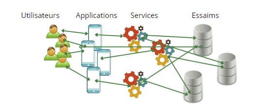

Be Swarm est une plateforme décentralisée, évolutive et dynamique.

Elle s'articule autour de 4 composants principaux :

* Les services
* Les essaims
* Les utilisateurs
* Les applications

## Les services
Se sont les web api qui permettent d'accéder aux données de l'utilisateur.
Les services sont dynamiques et plusieurs services différents peuvent servir les mêmes essaims.
Chaque service dispose d'un point d'entrée public.

## Les essaims
Les essaims peuvent être assimilés à des bases de données et/ou a des espaces de stockage.
Ce sont dans un essaim que les données d'un utilisateur sont stockées.
Un essaim peut être servi par plusieurs services différents.
Le but d'avoir plusieurs essaims permet d'assurer une forte disponibilité des données de l'utilisateur.
Si un essaim venait à être indisponible, seuls les utilisateurs qui y ont accès seraient impactés.
Cela permet également d'avoir des essaims au plus proche des utilisateurs afin de garantir une bonne performance.

## Les utilisateurs
Ce sont les utilisateurs de la plateforme.
Un utilisateur a l'ensemble de ses données dans un seul et unique essaim.
Essaim qu'il a choisi au moment de la création de son compte.

## Les applications
Ce sont toutes les applications développées autour de la plateforme BeSwarm que l'utilisateur peut utiliser.

<iframe width="560" height="315" src="https://www.youtube.com/embed/9orPNlLjHcM" title="YouTube video player" frameborder="0" allow="accelerometer; autoplay; clipboard-write; encrypted-media; gyroscope; picture-in-picture" allowfullscreen></iframe>