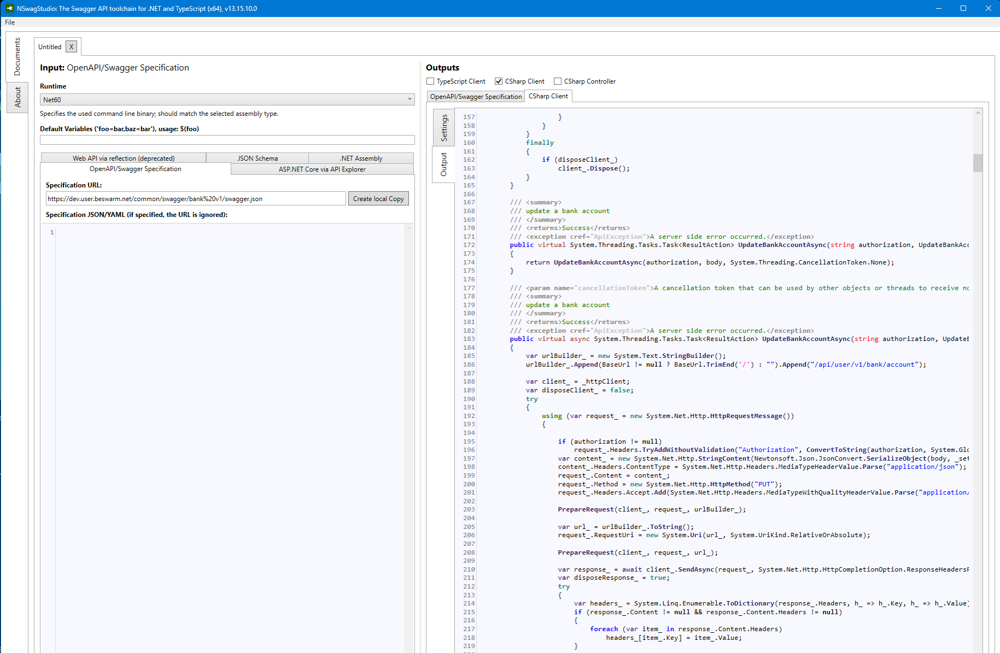
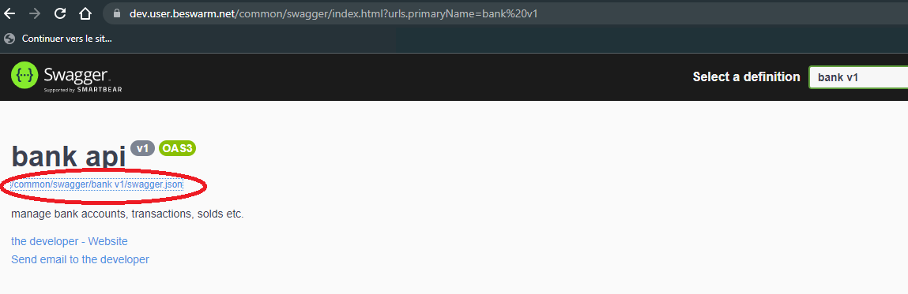

De part la description openapi des web api, il est possible de genérer le code source nécessaire à
l'utilisation des web api.
Cela permet de gagner un temps de développement considérable dans la mesure ou toutes les url, les objets,
les attributs de contrôle sont automatiquement générés.

Pour cela il existe différentes solutions comme par exemple Nswag Studio.

Exemple:

Nota: La description des webapi au format openapi est disponible depuis l'url suivante

située sur la page swagger des interfaces
