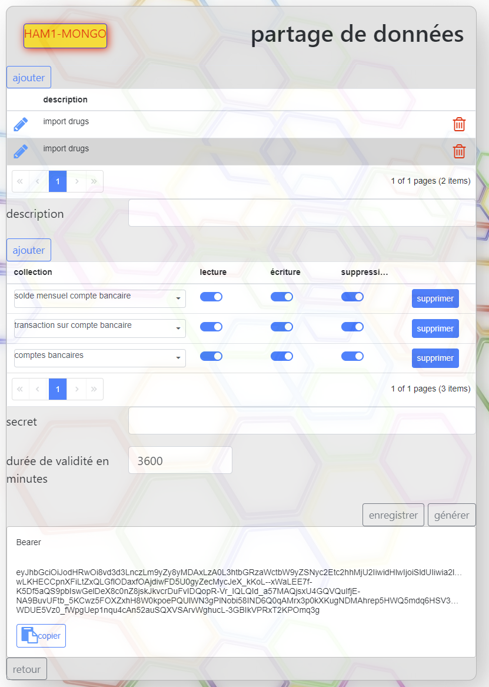
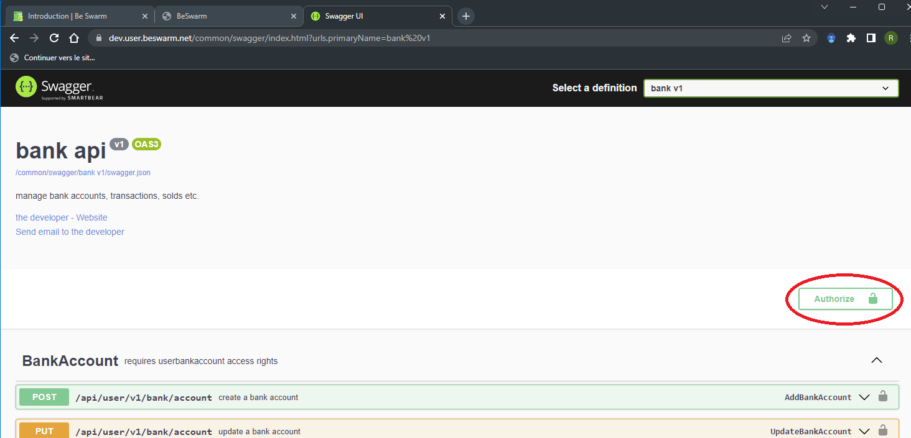

Les données des utilisateurs ne sont accessibles aux application que par l'intermediaire de l'API BeSwarm.
Cette API est une API REST qui permet de manipuler les données des utilisateurs.

Ces web api sont classées par type de données manipulées.

La liste exhaustive de ces web api est accessible via l'interface utilisateur swagger

https://dev.beswarm.net/common/swagger/index.html

Toutes les web api sont sécurisées par un token d'authentification.

(L'authentification est détaillée dans la section [Authentification](/docs/DevApps/NotionsDeBase/Authentification) 
et  [JetonJWT](/docs/DevApps/NotionsDeBase/LejetonJWT) )

Le jeton est à passer dans le header de la requête avec la variable Authorize

ex Authorize  Bearer .......

Il est possible de tester les web api en utilisant l'interface swagger.
Pour cela il faut au préalable avoir reçu ou généré un jeton utilisateur.

A des fins de développement l'espace utilisateur permet de générer un jeton.
Pour ce faire il faut se connecter à son espace puis aller dans la rubrique partage d'accès.

Il suffit ensuite d'ajouter les collections souhaitées ainsi que les droits d'accès voulus.
ex:

puis de cliquer sur le bouton générer.
Dès lors un jeton est généré il suffit de le copier et de l'utiliser depuis l'interface swagger comme cela:

Aller sur la section web api à tester puis cliquer sur le bouton Authorize et coller le jeton dans le champ.
Dès lors il est possible de tester les webapi.

<iframe width="560" height="315" src="https://www.youtube.com/embed/abiIUHf7ujM" title="YouTube video player" frameborder="0" allow="accelerometer; autoplay; clipboard-write; encrypted-media; gyroscope; picture-in-picture" allowfullscreen></iframe>