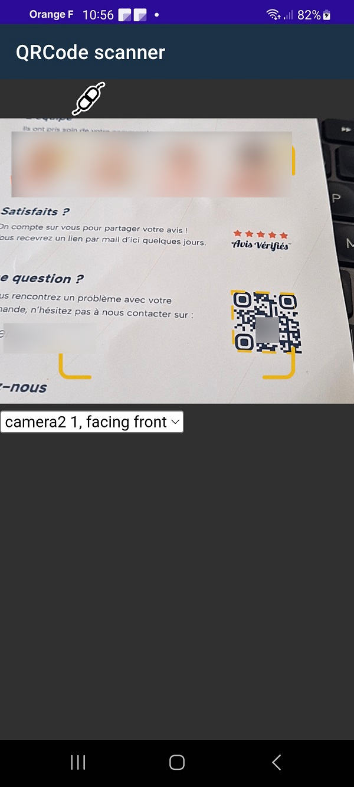
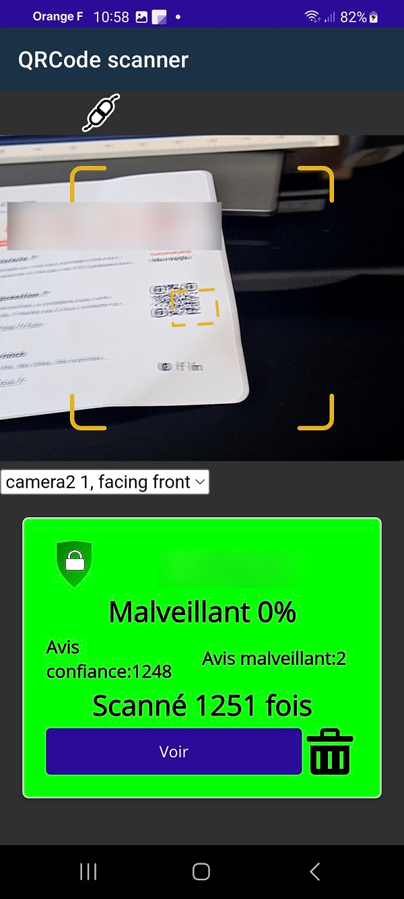
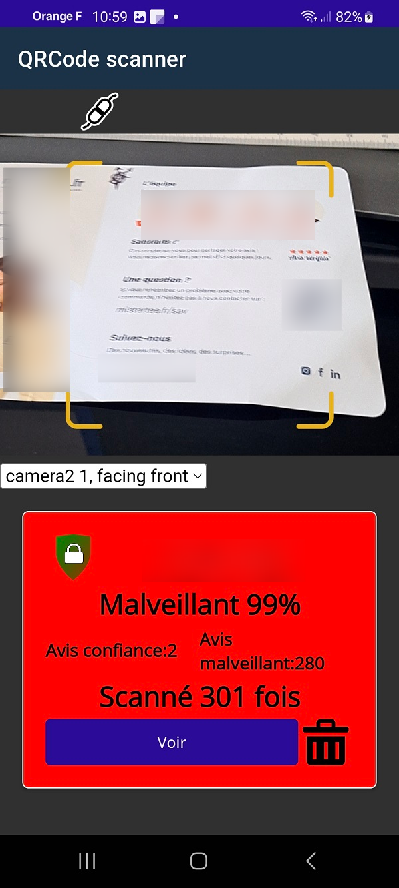
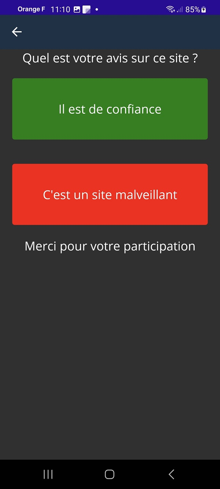

# L'application QrCodeSafe

Cette application permet de scanner des qrcode et de consulter les sites
en toute sécurité.

## Le probleme du qrcode
Avant se scanner un qrcode il est impossible de savoir quel site se trouve derrière ce qrcode.
On le découvre qu'une fois arrivé dessus et c'est souvent trop tard.
L'application QrCodeSafe apporte une réponse à ce problème majeur en affichant des informations
sur le site avant d'arriver sur sa page. Il est alors possible de se rendre compte que c'est un
site malveillant ou non sollicité.

## Fonctionnalités
L'application fonctionne aussi simplement que tous les lecteurs de qrcode du marché.
Il suffit se scanner un qrcode. La différence est qu'après le scan au lieu d'afficher directement
la page, il est affiché toutes les informations nécessaires au contrôle de ce site.
Les informations sont notamment:
Le nom de domaine réel.
L'indice de confiance.
Les appréciations des précédents utilisateurs.
Il est dès lors possible de choisir d'aller ou pas sur ce site.

# Les trois étapes
### 1 Scan du qrcode

### 2 Affichage des informations sur le site

Ce site est réputé fiable. L'utilisateur peut le consulter en tout sécurité.

:::info Information
Si le qrcode a été lu un grand nombre de fois avec beaucoup d'avis de confiance,
le site passera en site approuvé ce qui garantit qu'il est de confiance. Dans ce 
cas l'utilisateur peut le consulter sans problème. Etant donné que ce site a été approuvé,
il ne sera plus nécessaire de donner son avis.
:::

Ce site est réputé malveillant. Il n'est pas conseillé de le consulter.

### 3 Je donne mon avis
Après avoir consulté un site, je peux donner mon avis et ainsi enrichir l'expérience
pour les prochains utilisateurs.

## Configuration
L'application ne nécessite aucune configuration particulière.
Il peut cependant nécessiter de changer la caméra utilisée pour scanner le qrcode.
La plupart des téléphones possèdent deux objectifs. Un dédié à la vidéo et un dédié
à la prise de photos. Il convient se sélectionner celui dédié à la prise de photos afin
d'avoir une meilleure définition et donc une meilleure lecture.
Lorsque la caméra est sélectionnée elle le reste jusqu'au prochain changement.
